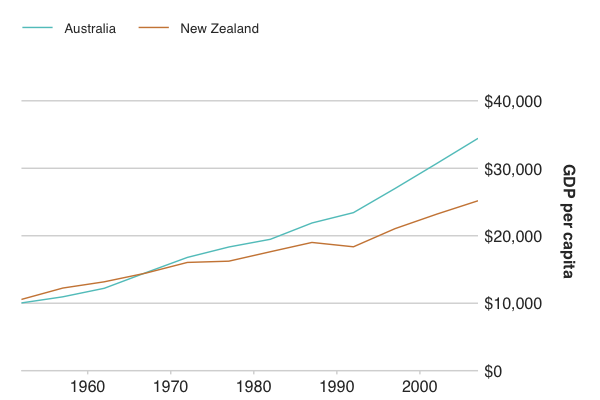
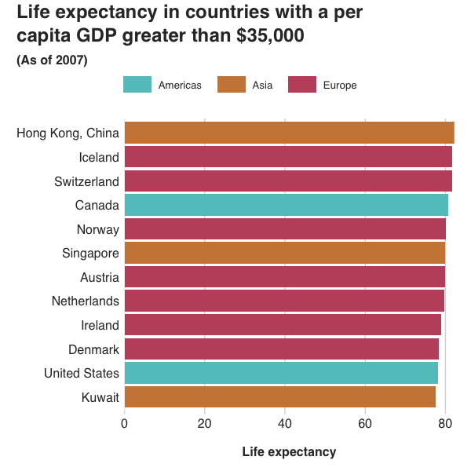
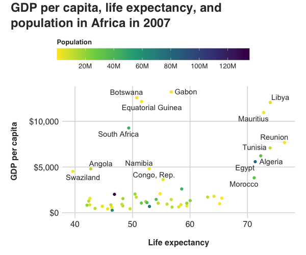

# randplot

 <!-- badges: start -->
  [](https://github.com/RANDCorporation/randplot/actions/workflows/check-full.yaml)
  <!-- badges: end -->

randplot is an R package that contains a [ggplot2](https://ggplot2.tidyverse.org) theme and color palettes for making graphics in the style that the RAND Communications Design team uses.


## Installation

If you don't have the [devtools](https://devtools.r-lib.org) package installed, install it with:

```r
install.packages("devtools")
```

devtools makes it possible to install randplot from this repository since randplot isn't on [CRAN](https://cran.r-project.org).

After devtools is installed, install randplot:

```r
devtools::install_github("RANDCorporation/randplot")
```


## Updates
Update randplot:

```r
devtools::update_packages(repos = "RANDCorporation/randplot")
```

`update_packages()` is a devtools function that can update randplot, other packages installed with devtools, and packages installed from CRAN.


## Usage

### Style graphics
This package contains a a theme for styling ggplot2 graphics. Use it like other ggplot2 themes by calling `theme_rand()`.

### Use palettes and color scales
This package also contains a categorical palette and a palette of sequential shades of gray. Both palettes contain nine colors each and are colorblind-safe. Some of the colors in the `RandCatPal` palette are similar to people with some kinds of colorblindness, but the colors are still distinguishable. If you need more than nine categories in your plot, you may want to consider visualizing your data in a different way.

#### Palettes
##### `RandCatPal`
`RandCatPal` includes various colors that are suitable for showing discrete, qualitative values:

- `#61c6c6`
- `#ce8644`
- `#c1536b`
- `#595a5a`
- `#e2c755`
- `#597cbe`
- `#45aF84`
- `#7995a5`
- `#af61a7`

##### `RandGrayPal`
`RandGrayPal` includes all of the grays that are used in RAND charts, plus additional grays for completeness:

- `#f1f1f1`: Used for "total" shape fills, such as background bars that represent 100% of something
- `#d7d7d7`: Used for grid lines.
- `#bdbdbd`
- `#a4a4a4`
- `#8c8c8c`
- `#747474`: Lightest color in this palette that can be used on a white background.
- `#5e5e5e`
- `#484848`
- `#333333`: Generally used for text.

Use `RandCatPal` or `RandGrayPal` by passing them to `scale_color_manual` or `scale_fill_manual`:

```r
scale_color_manual(values = RandCatPal)
scale_color_manual(values = RandGrayPal)
```

Access specific colors from randplot's palettes like this:

```r
RandCatPal[1] # Returns the first color in RandCatPal, #61c6c6
RandGrayPal[1:3] # Returns the first through third colors of RandGrayPal.
```

You can preview the colors in each palette by passing one of the two palette names to `show_rand_pal()`:

```r
show_rand_pal("RandCatPal")
```

#### Color scales
This package does not include custom RAND-branded color scales for continuous or  sequential  values. Here are a few recommended, colorblind-safe scales for different purposes.

##### Discrete values
For discrete sequential values, `scale_fill_viridis_d()` and `scale_color_viridis_d()` are great options. By default, these scales use the `viridis` palette. Set `"magma"`, `"plasma"`, or `"cividis"` as the `palette` value for a different palette. Read the [official documentation](https://ggplot2.tidyverse.org/reference/scale_viridis.html) for more information on how to use the Viridis scales.

For discrete diverging values, `scale_color_brewer(palette = "BrBg")` or `scale_color_brewer(palette = "RdYlBu")` are great options. See the [official documentation](https://ggplot2.tidyverse.org/reference/scale_brewer.html) for more information on how to use the ColorBrewer scales. 

##### Continuous values
For continuous values, `scale_fill_viridis_c()` and `scale_color_viridis_c()` are great options.

### Custom graphics
There will likely be times when you need to customize aspects of your graphic. To do this, you can pass properties to the `theme` function, like this:

```r
# Your plot here… + 
theme(
  axis.line.x = element_blank(),
  panel.grid.major.y = element_blank(),
  panel.grid.major.x = element_line(color = RandGrayPal[2])
)
```

See the [ggplot2 theme documentation](https://ggplot2.tidyverse.org/reference/theme.html) for more information on how to modify themes.

Themes don't control every visual aspect of graphics in ggplot2, so you'll likely need to pass additional options to plots. Here are a few especially useful settings:

- `xlab` and `ylab`: These control axis labels. Pass `NULL` to remove them from your chart, or pass a string to make a human-readable label.
- `coord_flip()`: Rotate a chart. Especially useful for bar charts that have a lot of bars.
- The `expand` parameter in `scale_x_continuous()` or `scale_y_continuous`: Set `scale_y_continuous(expand = c(0, 0))` in a plot to rid of extra space at the top and bottom of the chart.
- The `position` parameter in `scale_y_continuous()`: Set `scale_y_continuous(position = "right")` in a plot to place y-axis labels on the right, which helps emphasize the most recent values in time series line charts.

### Fonts
#### Graphics on RAND.org
Helvetica is the font used in graphics on rand.org, so Helvetica is the default font used in randplot.

#### Graphics in printed RAND reports
Helvetica Neue is the font used in printed RAND reports. To use Helvetica Neue with randplot, pass it as a string to `theme_rand()`, like this: `theme_rand("Helvetica Neue")`.

Many computers do not have Helvetica or Helvetica Neue installed. If your computer is one of them, then static ggplot2 graphics and Shiny ggplot2 graphics that use randplot and are served locally will fall back to using Arial. Arial is metrically compatible with Helvetica, and looks fairly similar. ggplot2 graphics that use randplot and are served via shinyapps.io will use Helvetica, regardless of whether it is installed on your computer or users' computers.


### Examples
#### Line chart with `RandCatPal` palette
```r
library(tidyverse)
library(scales)
library(gapminder)
library(randplot)

gdp <-
  gapminder %>%
  filter(continent == "Oceania")

ggplot(gdp, aes(x = year,
                y = gdpPercap,
                color = country)) +
  geom_line() +
  scale_x_continuous(expand = c(0, 0)) +
  scale_y_continuous(
    expand = c(0, 0),
    labels = dollar_format(),
    limits = c(0, max(gdp$gdpPercap) + 10000),
    position = "right"
  ) +
  scale_color_manual(values = RandCatPal) +
  xlab(NULL) +
  ylab("GDP per capita") +
  theme_rand()
```



#### Bar chart with `RandCatPal` palette and custom theme adjustments
```r
library(tidyverse)
library(scales)
library(gapminder)
library(randplot)

gdp <-
  gapminder %>%
  filter(gdpPercap > 35000) %>%
  filter(year == 2007)
  
ggplot(gdp, aes(
    x = reorder(country, lifeExp),
    y = lifeExp,
    fill = continent
  )) +
  geom_col() +
  labs(title = "Life expectancy in countries with a per\ncapita GDP greater than $35,000",
       subtitle = "(As of 2007)") +
  xlab(NULL) +
  ylab("Life expectancy") +
  coord_flip() +
  scale_y_continuous(expand = c(0, 0)) +
  scale_fill_manual(values = RandCatPal) +
  theme_rand() +
  theme(
    axis.line.x = element_blank(),
    panel.grid.major.y = element_blank(),
    panel.grid.major.x = element_line(color = RandGrayPal[2])
  )
```



#### Scatterplot with Viridis color scale and custom theme adjustments
```r
library(tidyverse)
library(scales)
library(gapminder)
library(randplot)
library(ggrepel)

gdp <-
  gapminder %>%
  filter(continent == "Africa") %>%
  filter(year == 2007)
  
ggplot(gdp, aes(x = lifeExp,
                           y = gdpPercap,
                           color = pop)) +
  geom_point() +
  geom_text_repel(aes(label = country),
                  color = RandGrayPal[9],
                  max.overlaps = 5) +
  scale_y_continuous(labels = dollar_format()) +
  labs(title = "GDP per capita, life expectancy, and\npopulation in Africa in 2007",
       color = "Population") +
  xlab("Life expectancy") +
  ylab("GDP per capita") +
  scale_color_viridis_c(
    breaks = breaks_width(20000000),
    labels = label_number_si(),
    direction = -1,
    guide = guide_colorbar(
      title.position = "top"
    )
  ) +
  theme_rand() +
  theme(
    axis.line.x = element_blank(),
    panel.grid.major.x = element_line(color = RandGrayPal[2]),
    legend.key.width = unit(2, "cm"),
    legend.title = element_text(size = 10, face = "bold")
  )
```



## License
randplot is licensed under the [MIT](https://github.com/RANDCorporation/randplot/blob/master/LICENSE.md) license.
