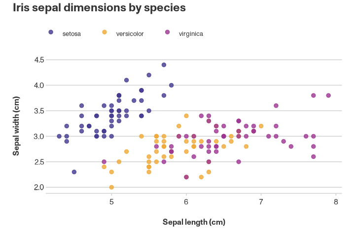
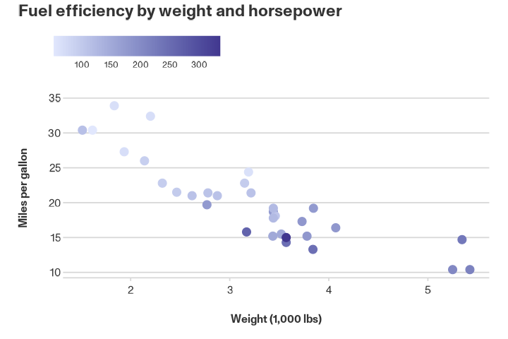
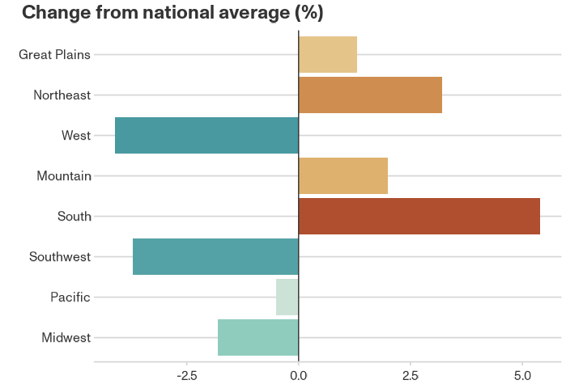

# randplot

 <!-- badges: start -->
  [](https://github.com/RANDCorporation/randplot/actions/workflows/check-full.yaml)
  [](https://app.codecov.io/gh/RANDCorporation/randplot?branch=main)
  [](https://www.tidyverse.org/lifecycle/#stable)
  <!-- badges: end -->

randplot is an R package that provides a [ggplot2](https://ggplot2.tidyverse.org) theme and color palettes for making graphics in the style of RAND's Communications Design team.


## Installation

Install from GitHub using [devtools](https://devtools.r-lib.org):

```r
# install.packages("devtools")
devtools::install_github("RANDCorporation/randplot")
```

Update an existing installation with:

```r
devtools::update_packages(repos = "RANDCorporation/randplot")
```


## Fonts

randplot uses **ABC Monument Grotesk** when available. If Monument Grotesk isn't configured, it falls back to **Inter** (loaded automatically from Google Fonts via the showtext package). If showtext isn't installed, it falls back to the system sans-serif.

To configure the font, call `rand_font_setup()` once with the path to your DINAMO font download (either the zip archive or the extracted folder):

```r
rand_font_setup("~/Downloads/DINAMO Order 2023-1505603.zip")
# or
rand_font_setup("~/fonts/Monument Grotesk/")
```

After that, randplot loads the font automatically every time the package loads — no further setup needed. Check the active font at any time with `rand_font()`.


## Theme

Apply RAND's visual style to any ggplot with `theme_rand()`:

```r
library(ggplot2)
library(randplot)

ggplot(iris, aes(x = Sepal.Length, y = Sepal.Width, color = Species)) +
  geom_point(size = 2, alpha = 0.8) +
  scale_color_manual(values = RandCatPal) +
  labs(
    title = "Iris sepal dimensions by species",
    x = "Sepal length (cm)",
    y = "Sepal width (cm)"
  ) +
  theme_rand()
```




## Color Palettes

randplot ships three palette categories matching RAND's brand guidelines. Pass any palette to `scale_color_manual()` or `scale_fill_manual()`. Do not mix colors from multiple palettes in a single chart. Preview any palette by name with `show_rand_pal("RandCatPal")`.

### Categorical — `RandCatPal`

Nine colorblind-safe colors for discrete, unordered groups:

```r
scale_color_manual(values = RandCatPal)
```

### Sequential

Four palettes for ordered data (low to high). Use with `scale_color_gradientn()` for continuous data, or index into specific stops for discrete ordered groups:

| Palette | Range |
|---|---|
| `RandSeqYellowBluePal` | yellow → blue |
| `RandSeqYellowPurplePal` | yellow → purple |
| `RandSeqBluePal` | light blue → ink |
| `RandSeqPinkPurplePal` | pink → purple |

```r
ggplot(mtcars, aes(x = wt, y = mpg, color = hp)) +
  geom_point(size = 3) +
  scale_color_gradientn(colors = RandSeqBluePal) +
  labs(title = "Fuel efficiency by weight and horsepower",
       x = "Weight (1,000 lbs)", y = "Miles per gallon", color = "Horsepower") +
  theme_rand()
```



### Diverging

Four palettes for data centered on a meaningful midpoint. The two ends are distinct hues; the center is neutral:

| Palette | Range |
|---|---|
| `RandDivTealOrangePal` | teal → orange |
| `RandDivBlueOrangePal` | blue → orange |
| `RandDivSteelSalmonPal` | steel → salmon |
| `RandDivInkSalmonPal` | ink → salmon (digital only) |

```r
ggplot(div_data, aes(x = change, y = region, fill = change)) +
  geom_col() +
  scale_fill_gradientn(colors = RandDivTealOrangePal, limits = c(-6, 6), guide = "none") +
  labs(title = "Change from national average (%)", x = NULL, y = NULL) +
  theme_rand()
```



### OKLCH interpolation with `rand_pal_n()`

`rand_pal_n(palette, n)` generates any number of colors by interpolating a palette's 9 stops in OKLCH space — the same perceptually uniform color space RAND's brand team uses:

```r
# 5-step discrete scale
scale_color_manual(values = rand_pal_n(RandSeqBluePal, 5))

# Smooth 256-step continuous gradient
scale_fill_gradientn(colors = rand_pal_n(RandSeqYellowBluePal, 256))
```

### Gray palette — `RandGrayPal`

Nine standardized gray shades for chart elements (grid lines, text, backgrounds):

```r
RandGrayPal[2]   # grid lines (#d7d7d7)
RandGrayPal[9]   # body text (#333333)
```


## Customizing themes

Layer a `theme()` call after `theme_rand()` to override specific elements:

```r
theme_rand() +
  theme(
    panel.grid.major.y = element_blank(),
    panel.grid.major.x = element_line(color = RandGrayPal[2])
  )
```

See the [ggplot2 theme documentation](https://ggplot2.tidyverse.org/reference/theme.html) for all available options.


## License

randplot is licensed under the [MIT](https://github.com/RANDCorporation/randplot/blob/master/LICENSE.md) license.
